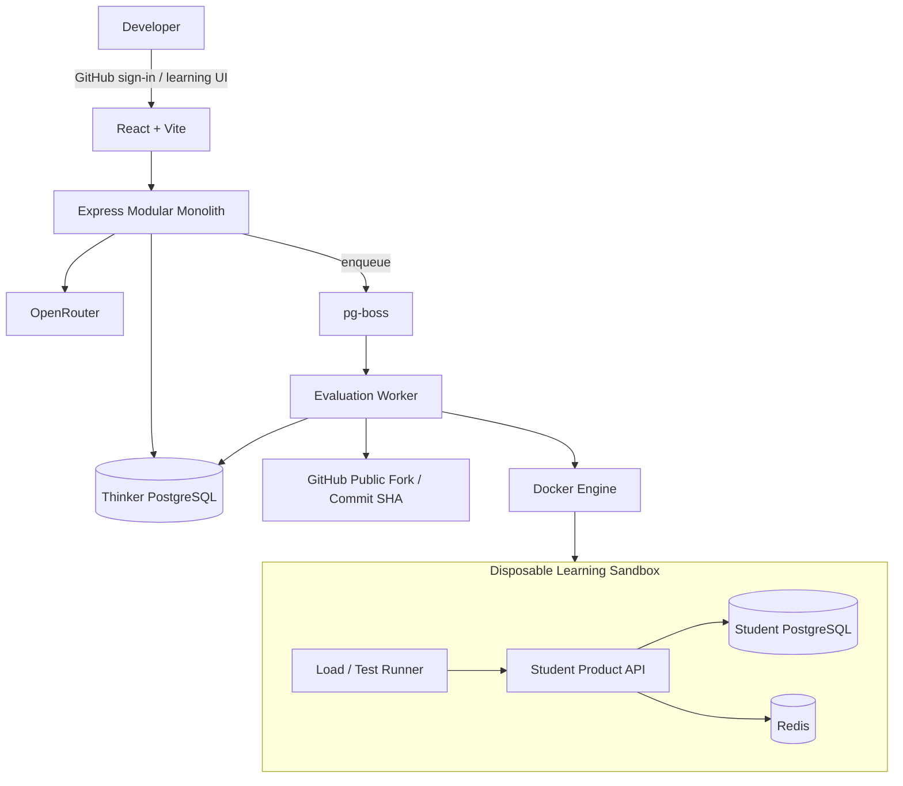
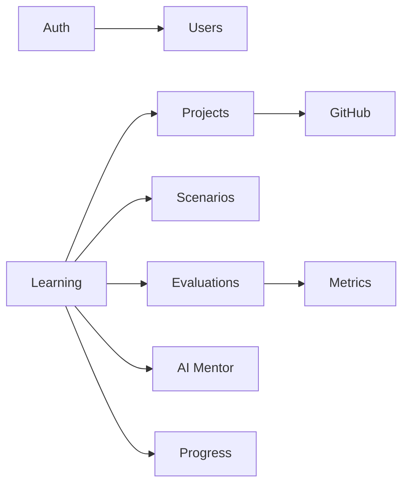
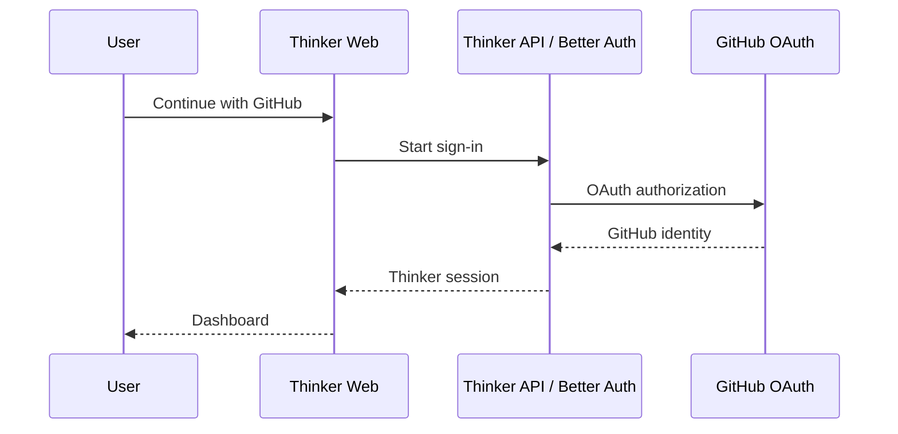
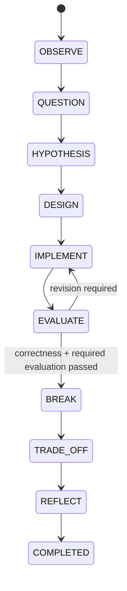
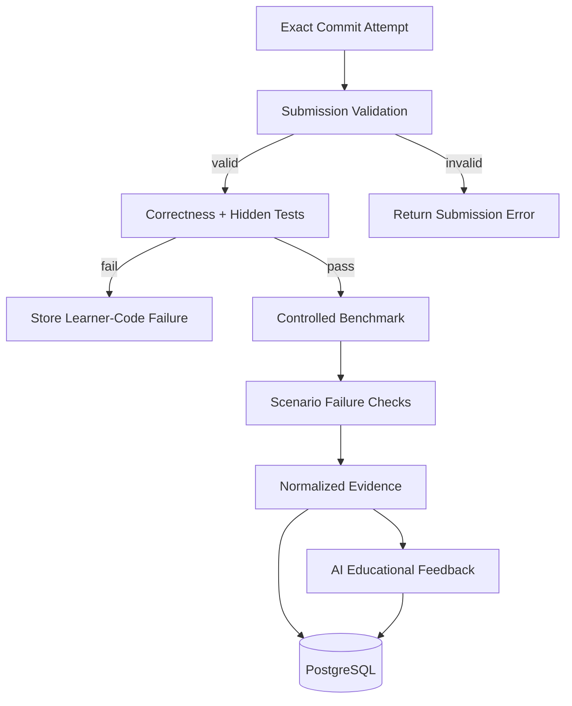
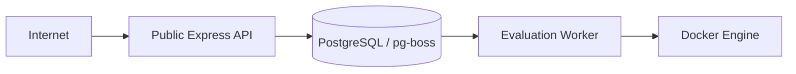
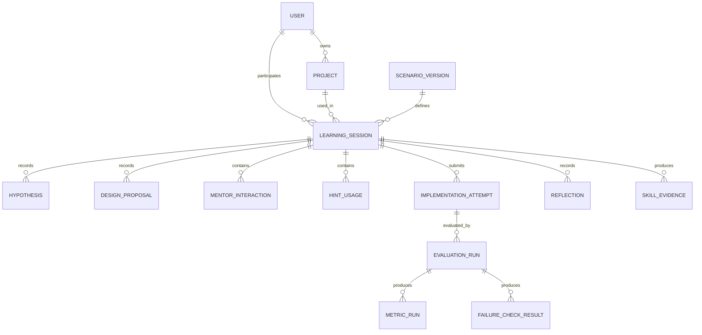
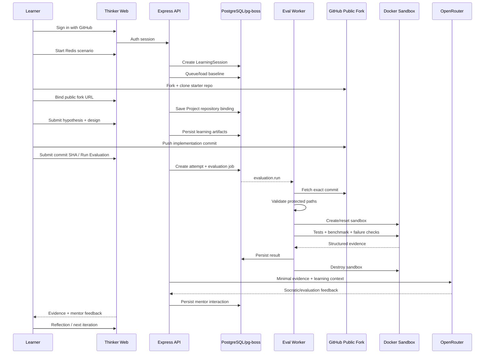

# Thinker — System Design Document

**Version:** 1.1  
**Date:** 21 September 2026  
**Stage:** MVP Architecture  
**Status:** Aligned with Thinker PRD v1.1

---

## 1. Executive Summary

Thinker is a hands-on engineering reasoning platform for developers who already know basic CRUD development. The MVP is designed to validate one complete learning loop before attempting arbitrary repository analysis or production-scale sandbox infrastructure.

The architecture is intentionally simple:

- **React + Vite + TypeScript** for the web client.
- **Node.js + Express + TypeScript** as a modular-monolith backend.
- **PostgreSQL** for durable control-plane data.
- **Better Auth + GitHub sign-in** for user identity.
- **pg-boss** for asynchronous jobs using the same PostgreSQL instance.
- A separate **evaluation worker** with Docker access.
- **Docker** sandboxes for Thinker-controlled learning repositories.
- **OpenRouter** behind an AI-provider abstraction, using a configurable free model when available.
- Students code locally in **VS Code**, push to a GitHub fork, and submit an exact **commit SHA** for evaluation.

The central architecture rule is:

> **Deterministic execution establishes what happened. AI helps the learner reason about why it happened.**

---

## 2. Architecture Goals

The MVP architecture should:

1. Validate the Observe → Hypothesis → Design → Implement → Evaluate → Break → Trade-off → Reflect learning loop.
2. Keep the backend understandable and inexpensive.
3. Use clear module boundaries without introducing microservices prematurely.
4. Bind every implementation attempt to an exact Git commit SHA.
5. Make scenario and baseline versions reproducible.
6. Keep public API processes separated from Docker execution permissions.
7. Preserve learning/evaluation results when the AI provider is unavailable.
8. Prefer free/open-source infrastructure where practical.
9. Avoid giving GitHub authentication broader repository permissions than necessary.
10. Keep the system evolvable toward arbitrary user repositories later.

---

## 3. Non-Goals for MVP

The first architecture does not attempt to solve:

- Arbitrary repositories in every language/framework.
- Private user repositories without a GitHub App.
- Browser-based IDEs.
- AI-generated implementation commits.
- Automatic pull requests.
- Production-grade multi-tenant arbitrary-code execution.
- Kubernetes.
- Firecracker/microVM orchestration.
- Distributed worker scheduling.
- Multi-region execution.
- Full architecture-graph analysis of unknown repositories.
- A dedicated time-series database.

---

## 4. Final Technology Decisions

| Area | Decision | Rationale |
|---|---|---|
| Backend language | TypeScript | Shared language across web/server/worker and strong contracts. |
| Backend framework | Node.js + Express | Matches developer preference; simple and familiar. |
| Backend architecture | Modular monolith | Clear boundaries without distributed-system overhead. |
| Frontend | React + Vite + TypeScript | Simple SPA architecture; no need for SSR in MVP. |
| Control-plane database | PostgreSQL | Relational domain model + JSONB flexibility. |
| ORM/data layer | Drizzle ORM recommended | Lightweight TypeScript-first option; not a product-level dependency. |
| Authentication | Better Auth + GitHub | Developer-native sign-in flow. |
| Repository authorization | Public fork in MVP; GitHub App later | Separates identity from repository permission. |
| Internal job queue | pg-boss | Reuses PostgreSQL rather than adding Redis to Thinker itself. |
| AI provider | OpenRouter abstraction | Model can change when free availability changes. |
| MVP model | Configurable free model, e.g. DeepSeek when available | Free-first development without hard-coding model dependency. |
| Sandbox | Docker for Thinker-controlled repos | Sufficient scope for first-party challenge projects. |
| Student coding | Local VS Code + Git | Real workflow and lower complexity than browser IDE. |
| Evaluation identity | Exact Git commit SHA | Reproducibility and history. |
| First challenge technology | Redis inside sandbox | Allows caching, invalidation, outage, and stampede lessons. |

---

## 5. System Context

Thinker has two separate worlds:

1. **Thinker Control Plane** — product data, learning state, auth, jobs, AI orchestration.
2. **Learning Sandbox** — temporary runtime for learner code, scenario dependencies, tests, and benchmarks.

They must not share secrets, databases, or trust boundaries.



---

## 6. Control Plane vs Learning Sandbox

### 6.1 Thinker Control Plane Responsibilities

- Authenticate users.
- Manage Thinker sessions.
- Track projects and repository bindings.
- Store scenario/version metadata.
- Run the learning state machine.
- Persist hypotheses, design proposals, hints, attempts, reflections, and progress evidence.
- Queue evaluation jobs.
- Store evaluation status and normalized evidence.
- Orchestrate AI interactions.
- Display attempt history and progress.

### 6.2 Learning Sandbox Responsibilities

- Run the learner's exact submitted code.
- Run a scenario-specific PostgreSQL instance.
- Run Redis where required.
- Load deterministic seed data.
- Execute correctness tests.
- Execute benchmark workloads.
- Execute failure injections.
- Collect structured evidence.
- Be destroyed/reset after execution phases.

The Student PostgreSQL and Redis instances are **not** Thinker's own PostgreSQL or queue infrastructure.

---

## 7. Modular Monolith Design

The public backend remains one deployable Express application organized by business-domain modules.



### 7.1 Core Modules

| Module | Responsibilities |
|---|---|
| `auth` | Better Auth integration, GitHub sign-in, session/user context. |
| `users` | User profile and product preferences. |
| `github` | Public-repo validation in MVP; GitHub App/webhooks later. |
| `projects` | Thinker project instance, repository binding, source type, baseline relationship. |
| `scenarios` | Versioned scenario definitions, stages, hints, workloads, checks, protected paths. |
| `learning` | Session state machine, hypotheses, design, reflections, transition rules. |
| `evaluations` | Attempt creation, commit validation, job submission, status aggregation. |
| `metrics` | Evidence normalization and before/after comparison. |
| `ai` | Provider abstraction, prompt contracts, response validation, AI fallback behavior. |
| `progress` | Skill evidence and historical learning records. |

### 7.2 Infrastructure Adapters

- PostgreSQL/database adapter.
- pg-boss queue adapter.
- OpenRouter adapter.
- GitHub HTTP/API adapter.
- Docker adapter — available only to the worker process.
- Logging/telemetry adapter.

---

## 8. Suggested Repository Structure

```text
thinker/
├── apps/
│   ├── web/
│   │   └── React + Vite + TypeScript
│   │
│   └── server/
│       └── src/
│           ├── modules/
│           │   ├── auth/
│           │   ├── users/
│           │   ├── github/
│           │   ├── projects/
│           │   ├── scenarios/
│           │   ├── learning/
│           │   ├── evaluations/
│           │   ├── metrics/
│           │   ├── ai/
│           │   └── progress/
│           ├── infrastructure/
│           │   ├── db/
│           │   ├── queue/
│           │   ├── openrouter/
│           │   └── github/
│           ├── shared/
│           └── app.ts
│
├── workers/
│   └── evaluation-worker/
│       ├── src/
│       │   ├── runner/
│       │   ├── docker/
│       │   ├── submission-validation/
│       │   ├── benchmark/
│       │   ├── failure-checks/
│       │   └── cleanup/
│       └── main.ts
│
├── packages/
│   ├── db/
│   ├── shared/
│   ├── scenario-contracts/
│   └── evaluation-contracts/
│
├── scenarios/
│   └── redis-product-cache/
│       ├── scenario.ts
│       ├── workloads/
│       ├── hidden-tests/
│       └── failure-checks/
│
└── docker/
```

The worker is a separate runtime process, not a separate business microservice.

---

## 9. Authentication and GitHub Integration

### 9.1 Sign-In Flow



GitHub sign-in establishes product identity only.

### 9.2 Repository Permission Separation

Signing in with GitHub must **not** automatically grant Thinker permission to all repositories.

Long-term repository authorization is a separate GitHub App installation using selected repositories and least privilege.

### 9.3 MVP Public Fork Workflow

The controlled MVP avoids repository permission complexity:

1. Thinker owns a public starter repository.
2. User forks it publicly.
3. User binds the fork URL to their Thinker project.
4. Thinker validates that the repository is reachable and compatible with the expected starter project.
5. User submits an exact commit SHA.
6. Worker clones/fetches that public repository and checks out the exact commit.

Private fork support is deferred until GitHub App integration.

### 9.4 GitHub Integration Phases

1. GitHub sign-in through Better Auth.
2. Manual public fork/clone of starter repository.
3. Manual repository binding + commit SHA submission.
4. GitHub App for selected repository access and push/commit discovery.
5. Existing/private repository analysis.

---

## 10. Project and Repository Model

A `Project` represents a learner's runnable code source within Thinker.

Recommended fields:

```text
Project
- id
- userId
- sourceType: THINKER_STARTER | USER_REPOSITORY
- starterProjectKey
- repositoryUrl
- repositoryOwner
- repositoryName
- defaultBranch
- createdAt
- updatedAt
```

For the MVP:

- `sourceType = THINKER_STARTER`
- `repositoryUrl` points to the learner's public fork.
- Evaluation attempts use explicit commit SHAs.

Later GitHub App fields may include installation ID and repository ID.

---

## 11. Scenario Definition Contract

A Scenario is versioned executable curriculum, not just text content.

The canonical MVP scenario definition should live in source control under `scenarios/` and include a stable scenario version.

Example shape:

```ts
interface ScenarioDefinition {
  key: string;
  version: string;
  title: string;
  learningIntent: string[];

  starter: {
    repositoryUrl: string;
    baselineCommitSha: string;
    protectedPaths: string[];
  };

  environment: {
    seedVersion: string;
    workloadVersion: string;
    requiredServices: Array<'postgres' | 'redis'>;
  };

  stages: ScenarioStage[];
  correctnessChecks: CheckDefinition[];
  performanceChecks: CheckDefinition[];
  failureChecks: CheckDefinition[];
  evaluationProfiles: EvaluationProfileDefinition[];
  skillEvidenceRules: SkillEvidenceRule[];
}
```

### 11.1 Scenario Versioning Rule

Every LearningSession stores the exact scenario version it started with.

Changing the scenario later creates a new version rather than mutating historical meaning.

### 11.2 Stage-Aware Evaluation Profiles

A scenario defines evaluation profiles that unlock progressively. Checks are not all executed or revealed at once.

Example profiles:

```text
CORE            → submission validation + correctness + caching performance
INVALIDATION    → stale-cache/update experiment
RESILIENCE      → Redis-unavailable experiment
STAMPEDE        → concurrent cache-miss experiment
```

Each profile declares:

- Which learning stage can trigger it.
- Which checks run.
- Which evidence is visible to the learner.
- Which checks remain hidden for later stages.

The same `ImplementationAttempt` may have multiple `EvaluationRun` records with different profiles. This allows Thinker to run a new experiment against the same commit without forcing the learner to create an artificial new commit.

### 11.3 Protected Paths

The first scenario protects files such as:

```text
package.json
pnpm-lock.yaml / package-lock.json
Dockerfile
compose files
evaluation scripts
hidden tests
```

The worker rejects or flags attempts that modify prohibited paths.

This keeps dependency installation and sandbox execution under Thinker's control.

---

## 12. Learning Session State Machine

The learning session is the central product aggregate.



### 12.1 Stage Responsibilities

| Stage | System behavior | Learner behavior |
|---|---|---|
| Observe | Present baseline evidence. | Inspect symptoms. |
| Question | Ask deterministic or AI-assisted questions. | Explain observations. |
| Hypothesis | Persist hypothesis/evidence. | State why it is happening. |
| Design | Ask architecture/trade-off questions. | Propose solution before coding. |
| Implement | Wait for submitted Git commit. | Change code locally and push. |
| Evaluate | Run submission validation, tests, and benchmark. | Inspect measured results. |
| Break | Run controlled failure/stress checks. | Investigate new failure mode. |
| Trade-off | Present before/after/failure evidence. | Explain gains and losses. |
| Reflect | Capture final reasoning. | Summarize updated mental model. |

### 12.2 Transition Guards

- Hypothesis must exist before Design completes.
- Design proposal must exist before a first implementation evaluation.
- A commit must belong to the project's bound repository.
- Submission validation must pass before execution.
- Core correctness must pass before performance is considered successful.
- Required failure/trade-off tasks must be completed before session completion.

---

## 13. Learning Interaction Persistence

Because Thinker uses a persistent AI mentor, the system should store learning interactions separately from final journal artifacts.

Recommended entity:

```text
MentorInteraction
- id
- learningSessionId
- stage
- role: USER | MENTOR | SYSTEM_EVENT
- content
- hintLevelAtTime
- provider/model metadata when AI-generated
- createdAt
```

This provides:

- Conversation continuity.
- Auditability of hints/mentor behavior.
- Ability to reconstruct learning history.
- Data for evaluating whether hints become less necessary over time.

Raw code should not be stored as mentor-message content by default.

---

## 14. Exact Commit as Attempt Boundary

An `ImplementationAttempt` is immutable and references an exact Git commit SHA.

```text
LearningSession
  ├── Attempt #1 → commit a52fc91
  ├── Attempt #2 → commit f881bc2
  └── Attempt #3 → commit 76cd911
```

This prevents ambiguity around “whatever is currently on main.”

Recommended fields:

```text
ImplementationAttempt
- id
- learningSessionId
- repositoryUrl
- commitSha
- createdAt
- submissionValidationStatus
```

### 14.1 Push Detection vs Evaluation Trigger

In MVP, a push does not automatically run evaluation.

The user explicitly submits/selects a commit and clicks **Run Evaluation**.

This prevents accidental compute usage and evaluation storms.

GitHub push detection becomes a convenience feature later.

---

## 15. Submission Validation

Before learner code reaches Docker execution, the worker performs cheap validation.

Checks include:

1. Repository URL matches the project binding.
2. For the public-fork MVP, repository owner matches the authenticated GitHub user unless explicitly allowed otherwise.
3. Commit exists and is reachable.
4. Commit can be checked out exactly.
5. Submitted commit descends from the known scenario baseline commit.
6. Expected starter project marker/version exists.
7. Protected files are unchanged relative to the scenario baseline.
8. Repository size/file count is within MVP limits.
9. Required application source paths exist.

The result is stored separately from runtime correctness.

Possible statuses:

```text
PENDING
VALID
INVALID_REPOSITORY
INVALID_COMMIT
PROTECTED_FILE_CHANGED
PROJECT_VERSION_MISMATCH
LIMIT_EXCEEDED
```

---

## 16. Evaluation Architecture

Evaluation is evidence-first.



### 16.1 Evaluation Steps

1. Create `EvaluationRun` for attempt + scenario version + evaluation profile derived from the current learning stage.
2. Enqueue `evaluation.run` job.
3. Return queued status to frontend.
4. Worker fetches exact repository/commit.
5. Validate submission.
6. Create isolated sandbox.
7. Reset/seed scenario database.
8. Start dependencies and application.
9. Run health check.
10. Run correctness and hidden tests.
11. If correctness fails, store evidence and stop performance claim path.
12. If correctness passes, run controlled benchmark.
13. Run only the checks enabled by the current evaluation profile.
14. Normalize evidence and apply the profile's evidence-visibility rules.
15. Persist result and metrics.
16. Destroy sandbox.
17. Generate AI feedback from only the evidence appropriate to the learner's current stage.

AI feedback may be retried separately without rerunning the sandbox.

---

## 17. Evaluation Status Model

```text
QUEUED
→ PREPARING
→ VALIDATING_SUBMISSION
→ STARTING_SANDBOX
→ RUNNING_TESTS
→ BENCHMARKING
→ FAILURE_TESTS
→ ANALYZING
→ COMPLETED

Terminal alternatives:
FAILED_PLATFORM
FAILED_SUBMISSION
FAILED_CORRECTNESS
TIMED_OUT
CANCELLED
```

Separating failure categories is important so infrastructure failures are not presented as learner mistakes.

---

## 18. Baseline and Benchmark Reproducibility

A Thinker claim such as “your implementation is faster” must be based on comparable runs.

### 18.1 Version Binding

Each session/evaluation stores:

- Scenario version.
- Baseline commit SHA.
- Seed dataset version.
- Workload version.
- Runtime image version.

### 18.2 MVP Baseline Strategy

The session baseline is run using the scenario baseline commit in the same controlled worker environment used for the learner's scenario.

The baseline may be established once when the session starts and reused for later attempts as long as environment/scenario versions remain unchanged.

### 18.3 Benchmark Reset Rules

Before benchmark phases:

- Reset PostgreSQL to deterministic seed data.
- Clear Redis state when required.
- Restart relevant services when scenario semantics require a cold start.
- Execute a short warm-up phase if measuring latency.
- Run multiple measurement rounds where practical.
- Prefer medians/relative comparisons to a single noisy latency observation.

### 18.4 Metric Interpretation

Database query count and correctness are more deterministic than latency.

Latency should be presented as measured evidence, not as a universal production guarantee.

---

## 19. Evidence Schema

Example normalized evidence:

```json
{
  "scenarioVersion": "redis-product-cache@1.0.0",
  "commitSha": "f881bc2",
  "correctness": {
    "passed": true,
    "testsPassed": 12,
    "testsFailed": 0
  },
  "baseline": {
    "dbQueries": 998,
    "p95Ms": 420
  },
  "attempt": {
    "dbQueries": 184,
    "p95Ms": 105,
    "cacheHitRate": 0.81
  },
  "failureChecks": {
    "staleCache": "passed",
    "redisUnavailable": "failed"
  }
}
```

The AI receives a minimized version of this structure relevant to the current teaching step.

---

## 20. Background Job Design

Long-running work never executes inside the HTTP request lifecycle.

### 20.1 Initial Job Types

| Job | Purpose | Retry policy |
|---|---|---|
| `baseline.run` | Establish session baseline. | Retry on infrastructure startup failure. |
| `evaluation.run` | Full implementation evaluation. | Retry only infrastructure failures; never hide deterministic learner failures. |
| `ai.feedback` | Generate mentor feedback from stored evidence. | Small retries for provider/rate-limit failures. |
| `sandbox.cleanup` | Remove leaked resources. | High-priority retry. |

### 20.2 Idempotency

Jobs are idempotent around stable IDs.

`EvaluationRun.id` is the idempotency key for full evaluation execution.

Reprocessing a queue delivery must not:

- Create a duplicate attempt.
- Associate evidence with a different commit.
- Overwrite a newer run.

Sandbox resource names include the evaluation ID.

### 20.3 User Concurrency Controls

To preserve free/limited compute:

- Default to one active evaluation per user/project.
- Reject or queue duplicate evaluation clicks for the same attempt.
- Apply small request rate limits to AI/hint endpoints.
- Use an explicit Run Evaluation action.

---

## 21. Sandbox Design

Docker is used only for Thinker-controlled repositories in the first MVP.

### 21.1 Redis Scenario Composition

```text
sandbox_<evaluationId>
├── student-api
├── student-postgres
├── redis
└── load-runner
```

### 21.2 Network Model

The sandbox gets its own isolated Docker network.

The student API can reach only the scenario services it requires.

Outbound internet should be disabled for the evaluation runtime whenever possible because the controlled scenario does not require arbitrary external access.

### 21.3 MVP Controls

- Ephemeral containers and network per evaluation.
- CPU limit.
- Memory limit.
- Process/PID limit where practical.
- Evaluation timeout.
- Benchmark timeout.
- Non-root execution where possible.
- No privileged containers.
- No production secrets.
- No Thinker control-plane credentials.
- No control-plane PostgreSQL access.
- No Docker socket inside learner containers.
- Explicit cleanup on success/failure/timeout/cancellation.

### 21.4 Dependency Strategy

For the controlled scenario, dependencies should be predeclared and locked by Thinker.

Prefer a prebuilt challenge runtime image so evaluation does not need to execute arbitrary package installation scripts from the learner's commit.

---

## 22. Worker Security Boundary

The public Express server must never directly manage Docker.



Only the worker process receives Docker permissions.

This prevents a compromise of the public API from automatically becoming Docker-host control.

---

## 23. AI Orchestration

OpenRouter is an adapter, not a domain dependency.

### 23.1 Provider Contract

```ts
interface AIProvider {
  askSocraticQuestion(input: SocraticInput): Promise<SocraticOutput>;
  reviewHypothesis(input: HypothesisInput): Promise<HypothesisReview>;
  reviewDesign(input: DesignInput): Promise<DesignReview>;
  explainEvaluation(input: EvaluationEvidence): Promise<EvaluationFeedback>;
  askReflection(input: ReflectionInput): Promise<ReflectionPrompt>;
}
```

### 23.2 AI Call Policy

Use deterministic scenario content whenever possible.

AI is used when:

- The learner's free-form answer requires interpretation.
- A personalized Socratic follow-up is useful.
- The design proposal needs contextual questioning.
- Stored evaluation evidence needs educational explanation.
- Reflection should adapt to the learner's actual attempt history.

Do **not** use AI for:

- Establishing whether tests passed.
- Measuring latency/query count.
- Deciding whether a commit exists.
- Basic known scenario questions that are already authored.

### 23.3 Minimal Context

Example:

```json
{
  "scenario": "repeated-product-reads",
  "scenarioVersion": "1.0.0",
  "stage": "observe",
  "hintLevel": 0,
  "learnerAnswer": "The DB seems to be hit almost every time.",
  "evidence": {
    "requests": 1000,
    "uniqueProductIds": 43,
    "databaseQueries": 998
  },
  "instruction": "Ask one Socratic follow-up. Do not mention Redis or caching."
}
```

### 23.4 Output Validation

Structured AI outputs are validated with Zod before persistence or use.

### 23.5 Teaching Guardrails

Prompt contracts should enforce stage/hint behavior:

- Do not reveal Redis at Hint Level 0–2.
- Do not generate the complete implementation by default.
- Explain syntax only when the current learning stage/hint level justifies it.
- Ask one focused question rather than overwhelming the learner.
- Ground claims in supplied evidence.

### 23.6 Free-Model Fallback

If OpenRouter/free model is unavailable:

- Store the deterministic evaluation result.
- Show authored scenario question/hints.
- Mark AI feedback as temporarily unavailable/retryable.
- Retry AI feedback independently later if requested.

An AI outage must never require rerunning the evaluation.

---

## 24. Prompt Injection Boundary

Repository files, README text, comments, and learner code are untrusted data.

They are never promoted into system/developer instructions.

For the controlled MVP, routine mentor calls do not need raw repository source at all.

Future repository analysis should transform code into bounded structured facts before passing those facts into educational prompts.

---

## 25. Data Model

The schema stores learning history as evidence rather than simple completion flags.

### 25.1 Core Entities

```text
User
Project
ScenarioVersion
LearningSession
Hypothesis
DesignProposal
MentorInteraction
HintUsage
ImplementationAttempt
EvaluationRun
MetricRun
FailureCheckResult
Reflection
SkillEvidence
```

### 25.2 Relationships



### 25.3 Selected Fields

#### `LearningSession`

```text
id
userId
projectId
scenarioVersionId
learningIntent
currentStage
baselineEvaluationId
status
startedAt
completedAt
```

#### `EvaluationRun`

```text
id
implementationAttemptId
scenarioVersionId
status
failureCategory
runtimeImageVersion
seedVersion
workloadVersion
startedAt
finishedAt
```

#### `SkillEvidence`

```text
id
learningSessionId
skillKey
sourceType
sourceId
level / qualitative result
detailsJson
createdAt
```

JSONB is appropriate for scenario-specific structured evidence but stable ownership/lifecycle relationships remain relational.

---

## 26. API Design

Exact paths can evolve, but responsibilities should remain stable.

### 26.1 Auth/User

```text
GET  /api/me
```

### 26.2 Scenarios

```text
GET  /api/scenarios
GET  /api/scenarios/:key
```

### 26.3 Projects

```text
POST /api/projects
GET  /api/projects/:id
POST /api/projects/:id/repository-binding
```

Repository binding payload for MVP:

```json
{
  "repositoryUrl": "https://github.com/user/thinker-product-api"
}
```

### 26.4 Learning Sessions

```text
POST /api/learning-sessions
GET  /api/learning-sessions/:id
POST /api/learning-sessions/:id/hypotheses
POST /api/learning-sessions/:id/designs
POST /api/learning-sessions/:id/hints
POST /api/learning-sessions/:id/reflections
```

### 26.5 Attempts and Evaluations

```text
POST /api/learning-sessions/:id/attempts
POST /api/attempts/:id/evaluations
GET  /api/evaluations/:id
```

Attempt payload:

```json
{
  "commitSha": "f881bc2..."
}
```

### 26.6 Mentor

```text
POST /api/learning-sessions/:id/mentor/messages
GET  /api/learning-sessions/:id/mentor/messages
```

### 26.7 GitHub Later

```text
POST /api/github/webhooks
GET  /api/github/installations
```

### 26.8 Polling Before WebSockets

The MVP polls `GET /api/evaluations/:id` for evaluation status.

If live progress later becomes important, prefer SSE before introducing WebSockets unless bidirectional persistent communication becomes necessary.

---

## 27. First Redis Scenario Runtime

### 27.1 Baseline

```text
GET /products/:id

1,000 requests
43 unique product IDs
~998 PostgreSQL reads
p95 latency = measured baseline
```

### 27.2 Learning/Execution Steps

1. Establish baseline from scenario baseline commit.
2. Show learner baseline evidence.
3. Capture hypothesis/design.
4. Learner pushes cache implementation.
5. Evaluate exact commit.
6. Verify normal API correctness.
7. Measure DB reads/cache hit behavior/latency.
8. Run product-update invalidation check.
9. After learner fixes freshness issue, reevaluate.
10. Stop Redis during request flow.
11. Observe whether API gracefully falls back or fails.
12. Store failure evidence.
13. Ask learner to explain accepted trade-offs.

### 27.3 Failure Injection

The worker, not learner code, controls scenario infrastructure.

For example, Redis outage check can:

```text
healthy app + redis
→ confirm request works
→ stop redis container
→ issue product request
→ capture response/status/logs
→ classify behavior
```

---

## 28. Observability

Thinker has two metric categories.

### 28.1 Platform Observability

- API request latency/errors.
- PostgreSQL connection/query errors.
- Queue depth/job wait time.
- Worker job success/failure/timeout.
- Sandbox startup/cleanup failure.
- Docker resource exhaustion.
- OpenRouter latency/rate-limit/error events.

### 28.2 Learning Evidence

- Correctness tests passed/failed.
- HTTP throughput.
- p50/p95/p99 when useful.
- Database query count and duration.
- Cache hit/miss rate.
- CPU/memory where meaningful.
- Failure-check outcomes.
- Hint usage.
- Stage duration.
- Number of design revisions/attempts.

Platform telemetry and learner evidence should not be mixed semantically.

---

## 29. Security Design

### 29.1 Threats and MVP Mitigations

| Threat | MVP mitigation |
|---|---|
| Public API compromise | No Docker socket on API process. |
| Arbitrary installation script | Locked dependencies, protected manifests, prebuilt runtime. |
| Learner changes evaluation harness | Protected paths + hidden tests outside submitted repo where possible. |
| Sandbox accesses control plane | Isolated network, no Thinker credentials. |
| Secret leakage | No production secrets inside learner sandbox. |
| Repository over-permission | Public fork workflow now; selected GitHub App repos later. |
| Prompt injection | Raw repository text is untrusted and not used as privileged instructions. |
| Runaway workload | CPU/memory/PID/time limits. |
| Duplicate evaluation | Evaluation ID idempotency and explicit trigger. |
| Hard-coded challenge cheating | Hidden tests and variable inputs. |
| Oversized repository | Submission size/file limits. |

### 29.2 GitHub OAuth Scope

The MVP GitHub sign-in flow should request only the identity scopes required by Better Auth/product login. It should not request broad repository scopes such as private-repository access merely for authentication.

### 29.3 Application Authorization

Authentication proves identity. Every protected resource still requires ownership checks:

```text
currentUser.id == project.userId
currentUser.id == learningSession.userId
```

Do not rely on opaque resource IDs alone.

### 29.4 Source and Token Handling

- Public starter-fork evaluation requires no long-lived private repo token.
- Better Auth OAuth credentials/tokens are control-plane secrets and are never sent to worker sandboxes.
- Future GitHub App access should use short-lived installation tokens.
- Checked-out source is ephemeral worker storage and is deleted during cleanup.
- Raw code should not be stored in PostgreSQL.

### 29.5 Data Retention and Deletion

- Worker checkout directories and sandbox files are deleted during cleanup.
- Persist only bounded/sanitized logs and normalized evidence needed for learning history.
- Repository bindings can be disconnected without modifying or deleting the user's GitHub repository.
- Account/project deletion should cascade or anonymize Thinker-owned learning data according to the product's retention policy.
- The exact long-term log-retention duration is a deployment/policy decision and is intentionally not hard-coded into the MVP architecture.

---

## 30. Reliability and Failure Handling

| Failure | Expected behavior |
|---|---|
| OpenRouter unavailable | Preserve evidence; deterministic UI remains available; AI feedback retryable. |
| Worker crashes | Job becomes failed/stale after timeout; cleanup job removes sandbox. |
| Sandbox cannot start | Mark platform/setup failure, not learner correctness failure. |
| Health check fails | Store diagnostics; classify based on whether failure is learner code or infrastructure. |
| Correctness tests fail | Return evidence; do not claim performance success. |
| Benchmark times out | Store timeout evidence; clean sandbox. |
| GitHub commit missing | Submission failure with repository/commit error. |
| Protected file changed | Reject before execution. |
| Control PostgreSQL temporarily unavailable | Durable queue/data resumes when database returns; API fails safely. |
| Duplicate evaluation click | Return/reuse existing active run for same attempt or reject duplicate. |

---

## 31. Free-First Deployment Strategy

The product is free-first, but safety boundaries are not negotiable for free hosting convenience.

### 31.1 Development / Private MVP

```text
Developer machine
├── web
├── server
├── Thinker PostgreSQL
├── evaluation worker
└── Docker sandboxes
```

OpenRouter uses a free configurable model when available.

### 31.2 Closed MVP

Possible topology:

```text
Free/low-cost web hosting     → React frontend
Free/low-cost API hosting     → Express control plane
Free hosted PostgreSQL        → Thinker control-plane DB + pg-boss
Controlled Docker machine     → Evaluation worker + sandboxes
OpenRouter free model         → Mentor, with deterministic fallback
```

Do not force untrusted execution onto a serverless host that cannot provide the required isolation model.

---

## 32. Scaling Path After MVP

Scale only after measured pressure appears.

| Pressure | Evolution |
|---|---|
| More evaluation concurrency | Multiple worker processes consuming pg-boss. |
| Worker host saturation | Worker pool / dedicated sandbox hosts. |
| Arbitrary untrusted repositories | Stronger isolation such as gVisor or microVM execution after threat-model review. |
| Private repositories | GitHub App selected-repository access. |
| More languages | Language-specific runner/analyzer adapters. |
| Heavy static analysis | Dedicated analysis jobs and cached architecture graph. |
| Real-time progress | SSE first; WebSocket only if justified. |
| Database pressure | Query/index/pool tuning before another datastore. |
| High AI usage | Provider/model routing, cache deterministic content, paid capacity only if product warrants it. |

The modular monolith can remain in place while workers scale independently.

---

## 33. Architecture Decision Records

| Decision | Status | Reason |
|---|---|---|
| Modular monolith over microservices | Accepted | Lower operational complexity with explicit domain boundaries. |
| PostgreSQL over MongoDB | Accepted | Strong relational model plus JSONB. |
| GitHub sign-in over Google | Accepted | Developer-native onboarding; identity-only scopes in MVP. |
| Identity separate from repo authorization | Accepted | Least privilege. |
| Public starter fork for first MVP | Accepted | Avoids premature GitHub App/private repo complexity. |
| Local VS Code over browser IDE | Accepted | Realistic workflow and lower cost. |
| Commit SHA as attempt identity | Accepted | Reproducibility. |
| pg-boss over Redis queue | Accepted | Avoid unnecessary Thinker infrastructure. |
| Docker for controlled MVP | Accepted with scope | Suitable for first-party repository execution. |
| AI as teacher, not judge | Accepted | Ground truth comes from deterministic evidence. |
| Explicit evaluation button | Accepted | Controls compute usage. |
| Scenario definitions versioned in source | Accepted | Reproducible curriculum and evaluation. |
| Protected files + hidden checks | Accepted | Safer execution and reduced challenge gaming. |

---

## 34. MVP Build Sequence

1. Create workspace/monorepo skeleton.
2. Build modular Express server.
3. Configure PostgreSQL migrations/data layer.
4. Configure Better Auth with GitHub sign-in.
5. Implement User, Project, ScenarioVersion, LearningSession domain models.
6. Create Thinker-owned Product API challenge repository.
7. Create versioned Redis scenario definition and deterministic seed/workload.
8. Implement public repository binding and exact commit submission.
9. Implement protected-path submission validation.
10. Build evaluation worker and Docker adapter.
11. Implement sandbox reset/seed/health-check lifecycle.
12. Add correctness and hidden tests.
13. Add benchmark evidence collection.
14. Add pg-boss asynchronous evaluation jobs.
15. Implement learning state machine and transition guards.
16. Add deterministic scenario questions and hint ladder.
17. Add OpenRouter AI provider and Zod output validation.
18. Add persistent mentor interactions.
19. Implement cache invalidation and Redis outage checks.
20. Add reflection and evidence-backed progress history.
21. Add platform observability and cleanup/recovery jobs.
22. Only after the complete controlled loop works, add GitHub App commit detection/private repos.

---

## 35. Deferred Decisions

These decisions are intentionally deferred:

- Exact production hosting provider.
- Exact hosted PostgreSQL vendor.
- gVisor vs Firecracker/microVM sandboxing for arbitrary repositories.
- Static analysis/AST technology for multiple languages.
- Architecture graph representation for user repositories.
- SSE vs WebSocket long-term.
- Dedicated time-series metrics database.
- Billing/subscription model.
- Multi-region worker execution.

---

## 36. End-to-End MVP Sequence



---

## 37. Final Architecture Statement

> **Thinker MVP is a TypeScript modular monolith that coordinates GitHub-authenticated learning sessions and exact Git commit attempts; PostgreSQL stores durable product data and pg-boss jobs; a separate Docker-enabled worker evaluates Thinker-controlled repositories; deterministic tests, benchmarks, and failure checks create the evidence; and an OpenRouter-backed AI mentor turns that evidence into Socratic guidance without becoming the source of truth.**

The architecture deliberately optimizes for validating the engineering-reasoning learning loop before paying the complexity cost of arbitrary repositories, microservices, or production-scale sandbox infrastructure.
